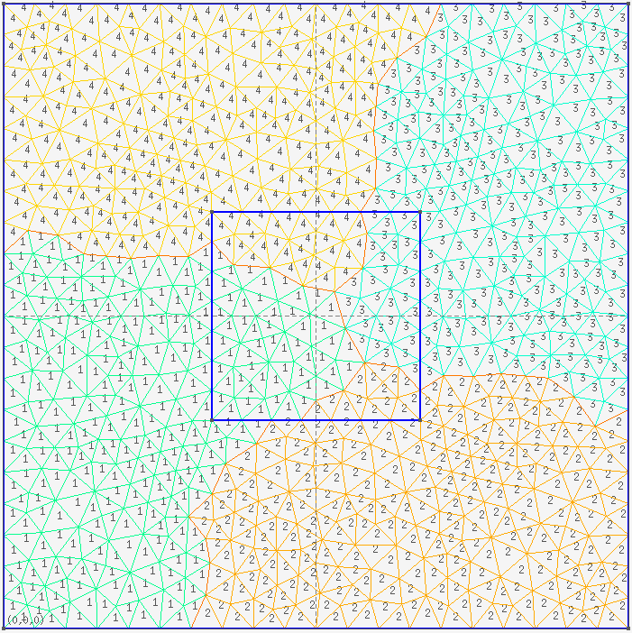

# Gmsh
Gmsh是一个开源的三维有限元网格剖分软件，内置CAD引擎和后处理器。


该软件有区域分解功能，可以直接指定分n个区域，然后可以输出n个网格信息文件gmsh.msh_000001, gmsh.msh_000002, ...,gmsh.msh_00000n。

# gmsh_interface
该模块实现gmsh的输出文件gmsh.msh的读取。

```
msh_file%init(file)
```

只需要指定文件名，就可以读取该文件中所有的信息。包括点的坐标，点的索引，区域内的网格信息，边界上的网格信息，单元的索引，单元的材料号等等，所有信息都存储在 msh_file 数据中。

通过该数据中的 get_** 函数可以获得所需要的信息。
```
xx = msh_file%get_**()
```
